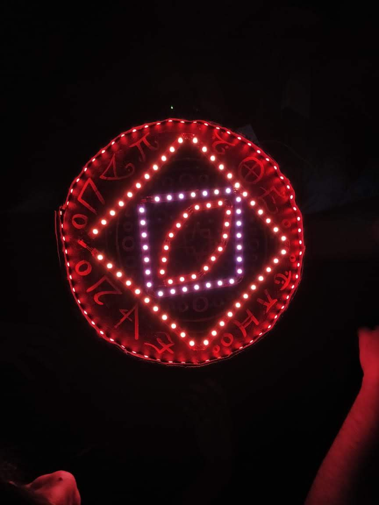

# Arduino-controlled Doctor Stange Spell Circle
## Made using WS2812B and FastLEDs.

This is the source code for the Doctor Strange standee and the spell circle that we made 
for DJ NSS Blood Donation event (04/feb/2019). Received great help from my seniors - 
Sanya, Devansh, Yogesh, Dhruti, and many others. The whole project took 2 weeks to complete.
This included finding the LED strips at a cheap price, testing the LED strips, designing
the prototype mount board, decorating, standee making, and the actual connections and soldering.

The LEDs are divided into 4 segments - Circle, Outer square, Inner square, Eye.
We tried to make it look like Doctor Strange's circle as much as possible.

Here's our first test run:

